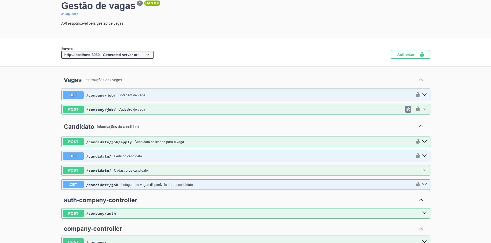
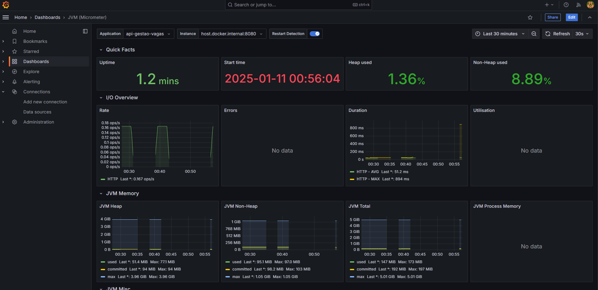
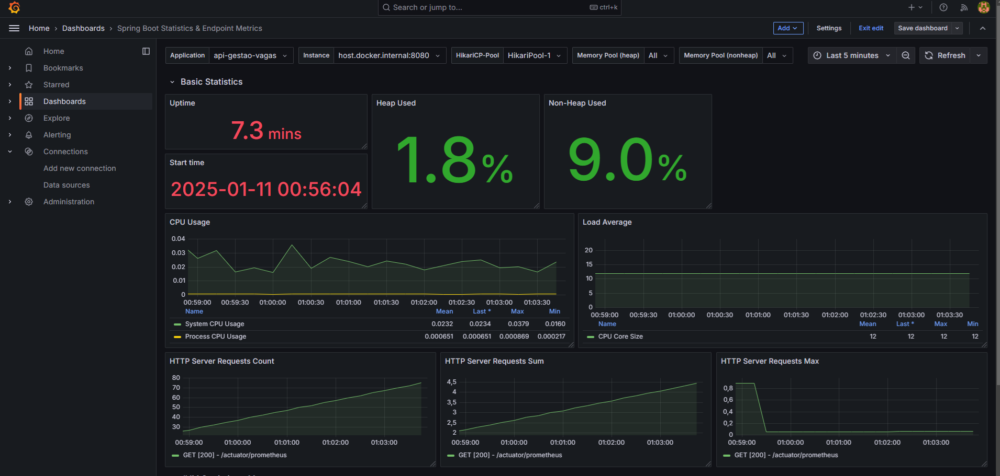

# gestao_vagas_java2

Aplicação back-end Java utilizando tecnologia Spring Boot,
é um app de gestão de vagas,
aonde empresas e candidatos podem se cadastrar,
existe autenticação JWT,
e empresas autenticadas podem postar vagas de emprego,
e candidatos podem aplicar para essas vagas.
as tecnologias utilizadas vão estar no arquivo pom.xml
dentro de dependencies.

